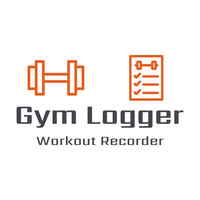

# Gym Logger

## Table of Contents

1. **Introduction**
2. **Structure**
3. **Design**
4. **Limitations**
5. **Features**
6. **Technologies**
7. **Development Lifecycle**
8. **Testing**
9. **Deployment**
10. **Usage**
11. **Collaboration**
12. **Acknowledgments**
13. **Further Development**
14. **Final Notes**

### Introduction

Gym Logger is a web application designed to aid the individual user in achieving their fitness goals, by creating an updatable and shareable library of workout plans based on the individual's own metrics and exercise records, and also those of the wider Gym Logger community, as well as common fitness metrics, standards and widely available online resources.

Through Gym Logger the experienced user will be able to keep a record of their recent workouts, build future workout plans, and share this with other users. They will also be able to login to view these records. Users who are just beginning their fitness journeys will be able to search for and save plans that are relevant to them and helpful to get them started. Both sets of users will be able to keep track of their developments and measure them against relevant metrics and updated information.

The live website can be found here <https://hawesjm-gym-logger-e6d66bbd0d21.herokuapp.com/>

### Structure

##### Architecture

Gym Logger is built with HTML5, custom CSS, JavaScript and Python to create a responsive and interactive full-stack web application which also contains back-end functionality that allows users to create, store and manipulate relevant data records.

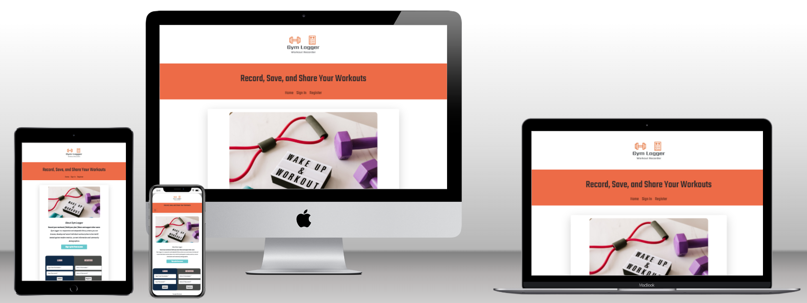

##### User Experience Design

For first time users I want the site to be easily navigable so the user looking for support in their fitness journey can easily browse workout plans created by fellow users who may share their needs, goals and experiences.
For first time users I also want them to be able to store any relevant information from their recent workouts in an intuitive and scaleable way.

For returning users I want them to be able to keep and access a record of other user's plans which appealed to them.
For returning users I also want them to be able to access records of their own workouts and view their performance metrics against those of the community.
For returning users I want them to be able to create and then share their own plans and records with other users for mutual benefit.

In all cases I am aiming for clear and easily navigable content on desktop, tablet and also mobile device so users can effectively set record their workouts, set goals and monitor their progress while working out or while taking some rest in their downtime. Each page of the website and each step of the form including results page will have a coherent, consistent style.

###### UX Design Principles

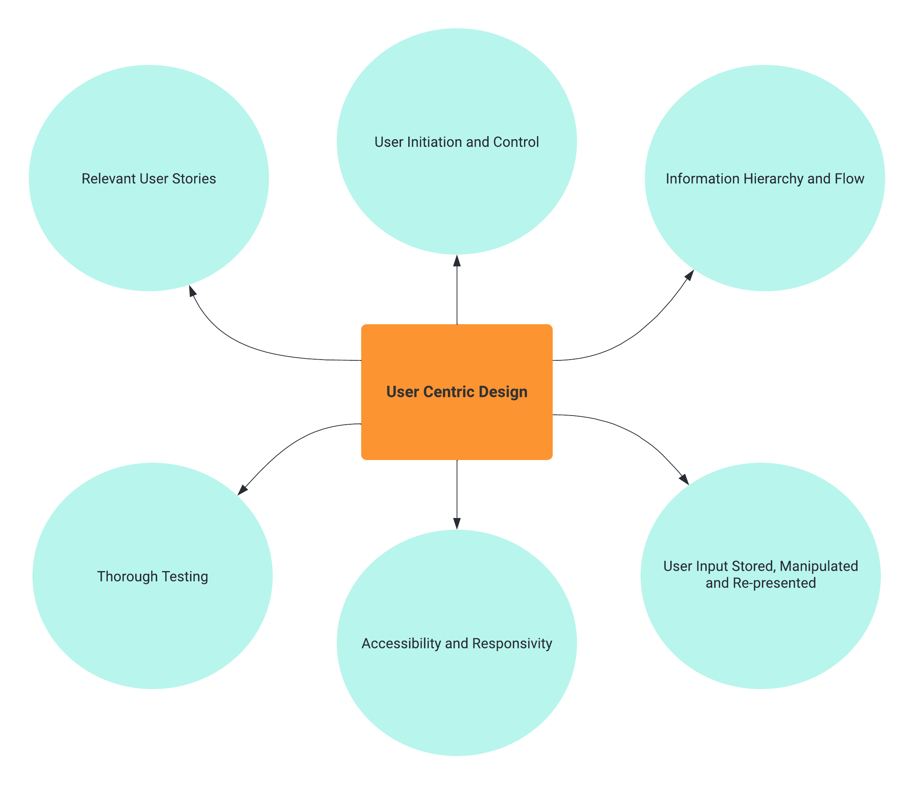

###### User Stories

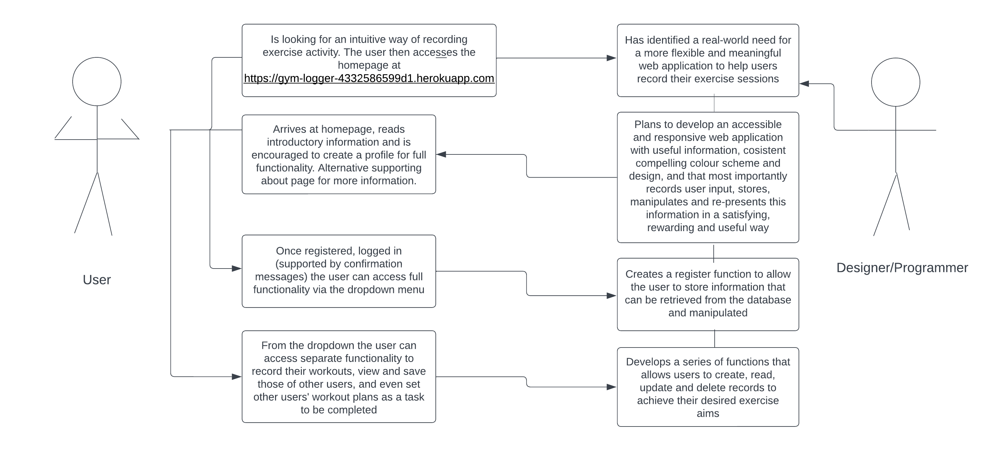

##### Navigation

The application/website will consist of one main landing page. This page will be scrollable and comprised of 3 sections: 1. introductory information, 2. the member's login/register area (main CTA), and 3. an of recommended/shared publicly available plans.

There will be a page listing all the visible logged workouts with a filter and search function, as well as actions to be taken (save, edit, delete or mark a workout as a task to be completed).

There will also be a profile section for registered members to view their information and records. There will also be a page for users to update information from their recent workouts.

The navigation menu will be collapsible on mobile devices to make best use of the available space. Across all devices and screen sizes the layout will remain clean and the order of the main form will progress logically, interactively and intuitively through well signposted submission fields and submission buttons where appropriate.

### Design

##### Colour Scheme

Over a paper white background Orange #ED6B47 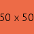 will be the main accent colour.  This will contain the main CTA button using Navy Blue #112A46 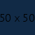 with a Grey #999 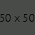 box shadow for contrast. Turquoise #7df9ffb3 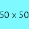 and Orange #ED6B47  are used as accent colours for buttons/progress bars and in hover instances to give feedback to the user. White #fafafa is used for text over buttons and form progress steps for clarity and contrast. Bootstrap button colour classes (green, red and blue) are also used where appropriate.

##### Typography

The main font used is Teko to enhance the modern industrial feel of the website with provision for using Roboto when this is necessary for further clarity.

##### Imagery

The Gym Logger logo will be displayed in the header of the main landing page, and will be present on all devices and screensizes. The exact placement, positioning and sizing of the logo may change depending on the screen size. The website also displays images for general motivation or to help clarify specific sections of information. Each workout displayed on the profile page will have a relevant header image depending on the main exercise type contained in the workout.

##### Wireframes

###### Homepage/Landing Page

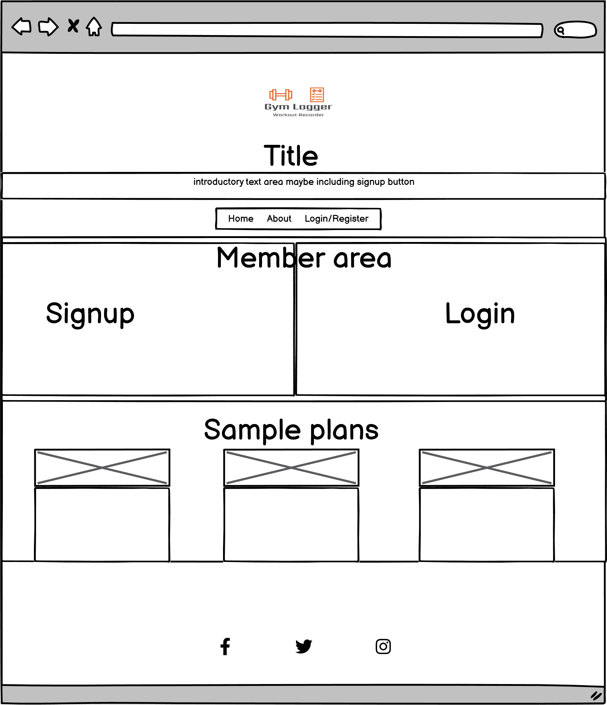

###### Profile Page

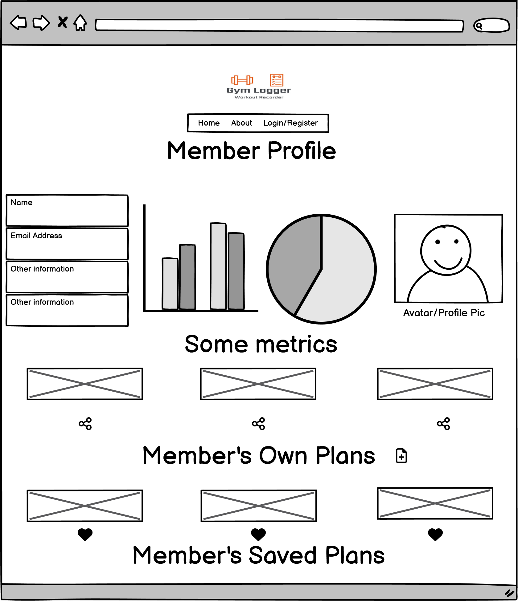

###### Full Workout List Page

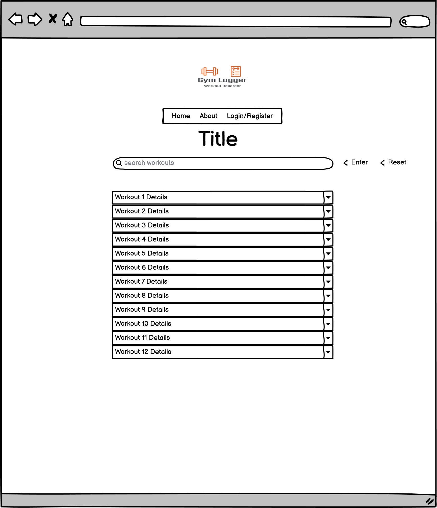

###### Add Workout Page

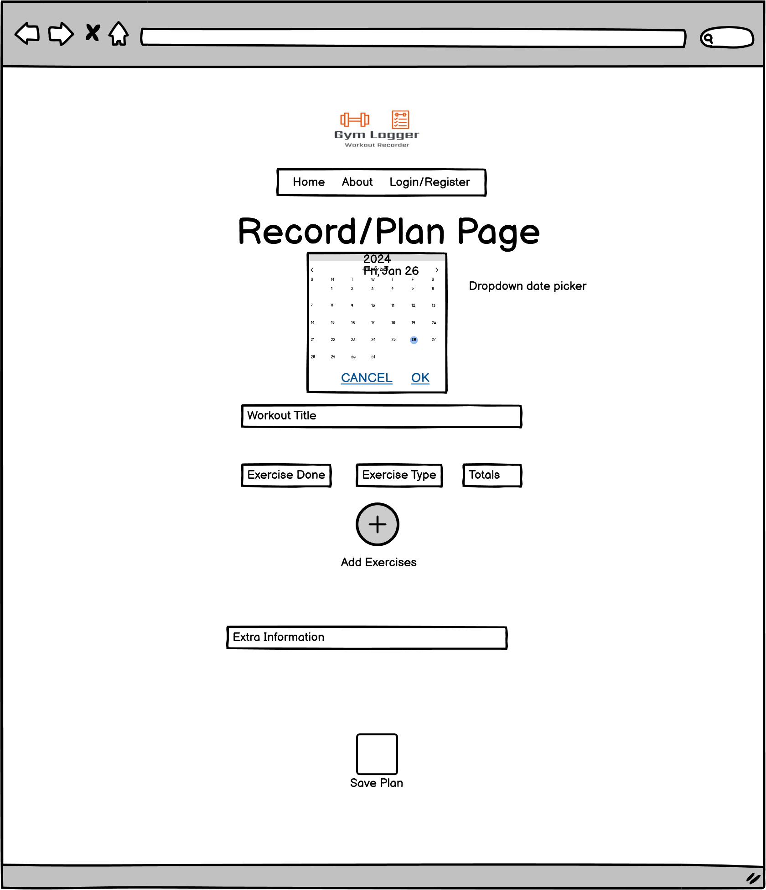

###### View & Act on Workout Details Page

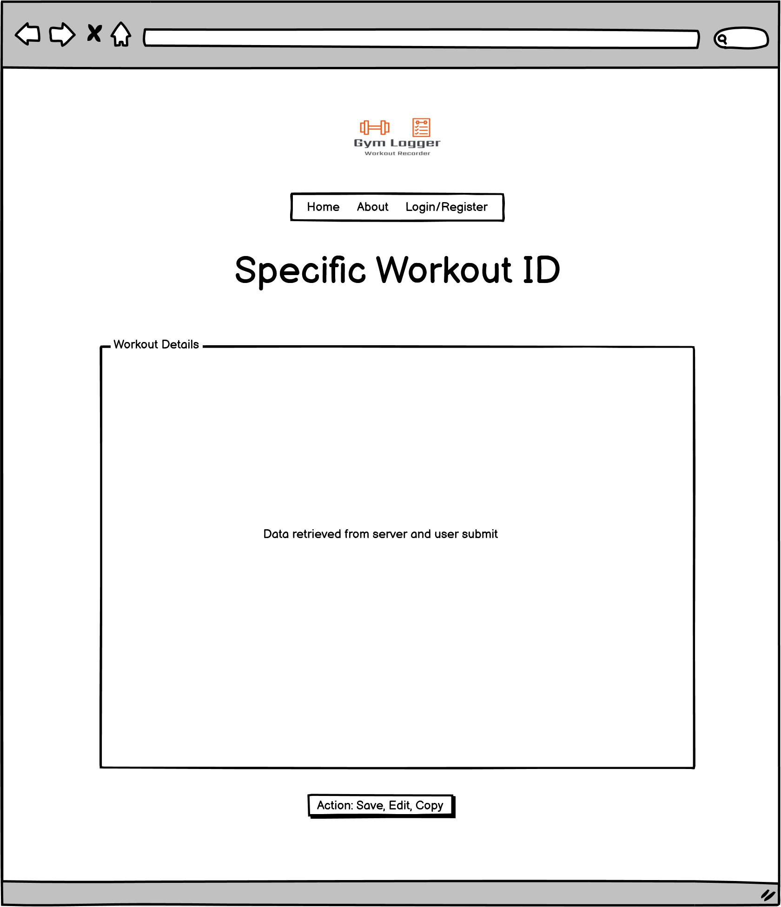

### Limitations

No APIs for extra external linkage or further functionality at this stage.  Currently limited to five exercises per workout. 

### Features

- Responsive main navigation bar
- Dropdown for existing users
- Register and login functions
- Example plans
- Create workout record function
- Read own and other users records function
- Update own workout records function
- Delete own workout records function
- Set existing workouts as a future task to complete function
- Search function
- Social links
- Further information page

### Technologies

- **HTML** This project uses HTML as the main language used to complete the structure of the website.
- **CSS** This project uses custom written CSS to style the Website.
- **JavaScript/JQuery** This project uses custom written JavaScript to add interactive elements to the website and allow the user to achieve their goals.
- **Bootstrap** The Bootstrap framework is used throughout this website for layouts and styling. This has also been used to import JavaScript/JQuery where necessary.
- **Python** This project uses Python to communicate with the database allowing the recording and manipulation of user data.
- **Flask**
- **MongoDB** - Database created with MongoDB
- **Font Awesome** Font awesome Icons are used in the Body of the site and for the Social media links contained in the Footer section of the website.
- **Google Fonts** Google fonts are used throughout the project to import the Teko and Roboto fonts.
- **Code Anywhere** The initial IDE for writing the code, using CI approved template.
- **Gitpod** Became the IDE used later.
- **GitHub** GithHub is the hosting site used to store the source code for the Website.
- **Heroku** Deploys the live version of the application.
- **Google Chrome Developer Tools** Google Chrome's built in developer tools are used to inspect page elements and help debug issues with the site layout and test different CSS styles.
- **Balsamiq Wireframes** This was used to create wireframes for 'The Skeleton Plane' stage of UX design.
- **place-hold.it** Place-hold.it was used to display the colours shown in the Color Scheme section. 
- **Lucid Lucid** Chart was used to create the diagrams for Use Case scenarios, UX Design Principles, and Project Lifecycle planning.

### Development Lifecycle

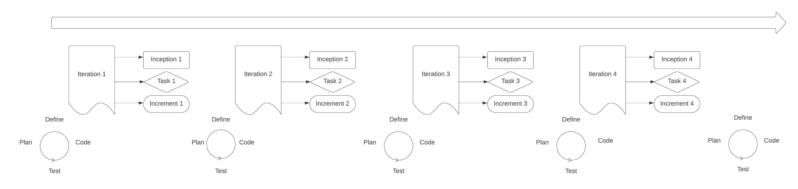

#### Iteration 1

- Inception: the user is looking for a flexible, intuitive and meaningful way of recording information about their workout sessions and exercises.
- Task: to meet this need the developer/programmer needs to create a responsive site with a clear aim easily allowing users to store their information.
- Increment: the developer creates a fully responsive HTML framework with full register, login and logout functionality to allow for records for multiple users to be created and recorded in the database. Once responsivity and database connectivity are confirmed the data model for user information is planned and developed. They then make the initial commit to GitHub and Heroku as the basis for future deployment.

##### Initial Data Model

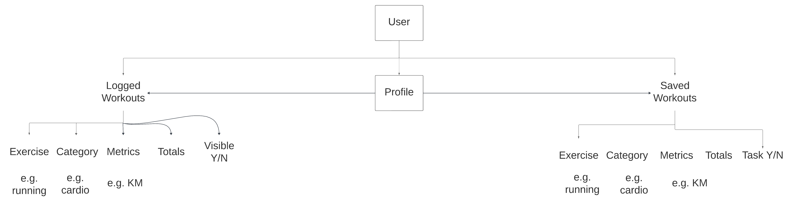

The data schema will comprise of the main collections of Users (username and hashed password), Workouts (the main collection that stores all the information from a user created workout record), and the specific Exercises themselves plus their Categories (e.g.exercise type) which will be logged for future development.

#### Iteration 2
- Inception: having registered the user now wants to begin recording their workouts. They want to be able to view and refer to these records, as well as potentially edit or update them. The user would also like to view the records of others and possibly share their own records which might be useful to other users.
- Task: to meet these needs the developer/programmer creates input forms that record relevant user information and sends it for storage in the database. They create a profile page to serve as the main hub for the individual user's information. They create a way of displaying  all publicly available information in a rational and concise way, allowing for edits where appropriate.
- Increment: the developer creates the profile page specific to each registered user, along with the functionality for registered users to create, edit and delete their own records, as well as search for the records of others to save them for reference or as a challenge to be completed at a later date. Changes are pushed to Github and Heroku for future deployment.

#### Iteration 3
- Inception: the user will now have become familiar with the full functionality of the application. As they continue to use the application, creating, updating and deleting records, they need to have each action confirmed immediately as well as being recorded in their profile.
- Task: to ensure the user is supported the programmer creates and implements flash messages and input validation. The programmer is to test that all functions and supporting messages display on different browsers and screensizes. 
- Increment: the developer creates flash messages for creating a workout, editing a workout, saving a workout, deleting a workout, and completing a workout challenge. Once confirmed all changes are pushed to Github and Heroku for future deployment.

#### Iteration 4
- Inception: the user will now have become a regular user of the site, and will need to continue to use the application.
- Task: The programmer devises and implements a paradigm and page to offer returning users supporting information for their continued use of the application. To ensure the above the programmer will deploy the application on a live hosting platform. 
- Increment: After thorough manual and automated testing procedures the completed application is pushed to Github and deployed on Heroku with Debug Off.

### Testing

#### Strategy

The project depends upon the ability to store and manipulate information provided by each user. Testing is therefore firstly designed to ensure that all input elements function correctly, are validated, and stored in a usable format. These inputs need to be contained in a framework meeting responsivity and accessibility guidelines, so procedures to ensure this will also be implemented. Users will need to see all of their information in one place so testing procedures to ensure all actions are confirmed and then displayed on the profile page will also be devised.

All elements should remain on the screen at sizes above 300px. All internal nav links should direct to the correct pages. All external links should open in a new window. All form inputs should be validated on submission. Form results should vary depending on user submitted information.

All testing conducted on live deployed pages.

#### Initial Bugs (pre-deployment)

- In a previous deployment the workout record form would not submit due to the "required" attribute on a hidden element. Attribute removed and the form submits successfully.
- In a previous deployment the workout collapsibles contained in workout.html would all activate if one was clicked. Fixed by creating new text field string with spaces removed as a record in the DB to pass as the unique ID for each workout element on the page.
- In a previous deployment the workout save button was misaligned in the individual workout records on the workouts.html page. This was fixed by using "display:inline" in inline CSS.
- In a previous deployment the input fields on the create record form for mobile were not aligned correctly. This was solved by overriding Bootstrap's gutters using CSS.
- In several previous deployments incorrect or irrelevant flash messages were showing in inappropriate areas of the site. This was fixed with correcting the syntax of Jinja if statements in the relevant templates.
- In a previous deployment number inputs on the workout forms would not accept or show decimal inputs. This was fixed by using the "step" HTML attribute on the number inputs.
- In a later stage deployment exercise 4 on the workout form became misaligned. Fixed by overwriting Bootstrap gutters from 1.5rem to 0.
- In a previous deployment information from the database was not passing correctly to the edit workout template and placeholder information was not being populated correctly with previously entered user data. Fixed by adding quotation marks to the Jinja 2 variable.
- In the same deployment information from the database was not passing correctly to the edit workout template and it would not show the user's workout record information beyond the first exercise recorded. Fixed by usinga Jinja if statement looking for truthy values.

#### Testing Methodology

#### Manual Testing Report

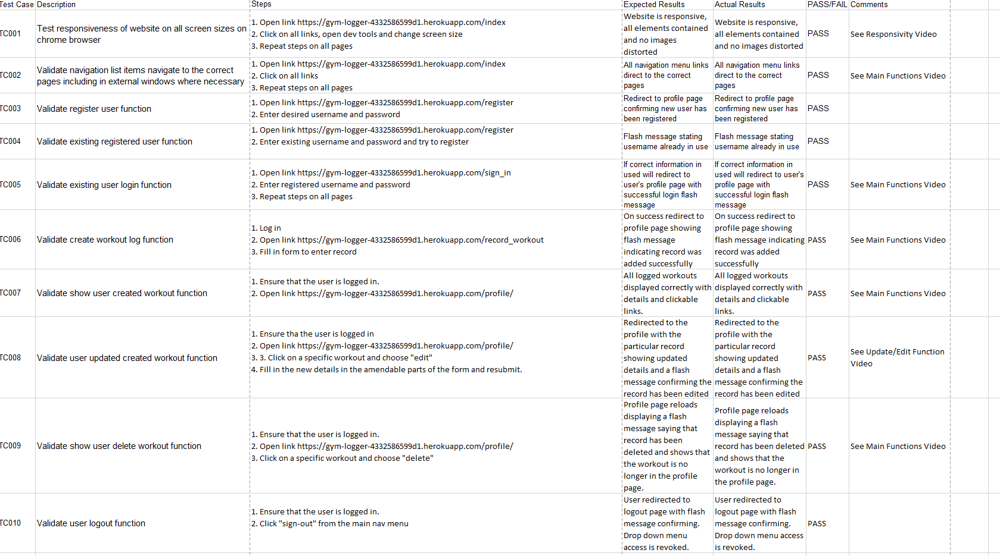

##### Testing Videos

https://github.com/HawesJM/gym-logger/tree/main/static/videos

##### Nu Html Checker

https://github.com/HawesJM/gym-logger/tree/main/static/images/readme/testing

All public pages passed through HTML verification with no errors

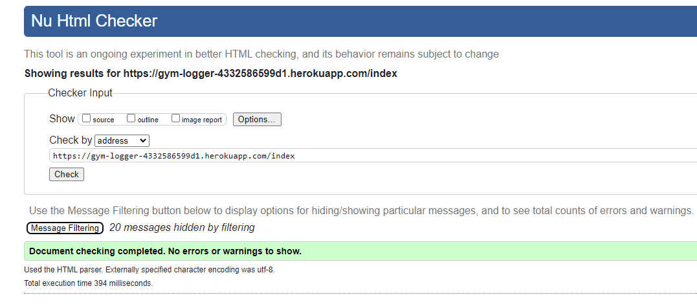

##### W3C CSS Validation

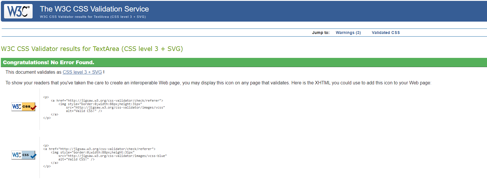

##### Lighthouse Checking

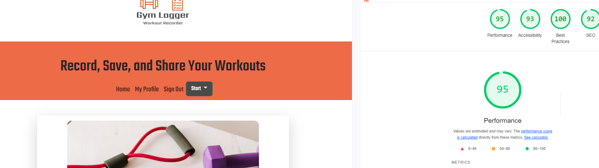

##### WAVE Accessibility Checking

All public pages passed through WAVE accessibility checking with no errors

https://github.com/HawesJM/gym-logger/tree/main/static/images/readme/testing

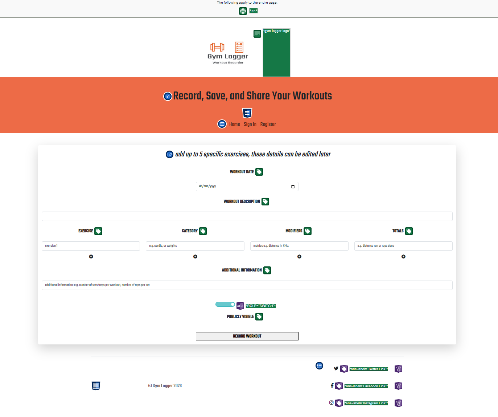

##### JSHint Checking

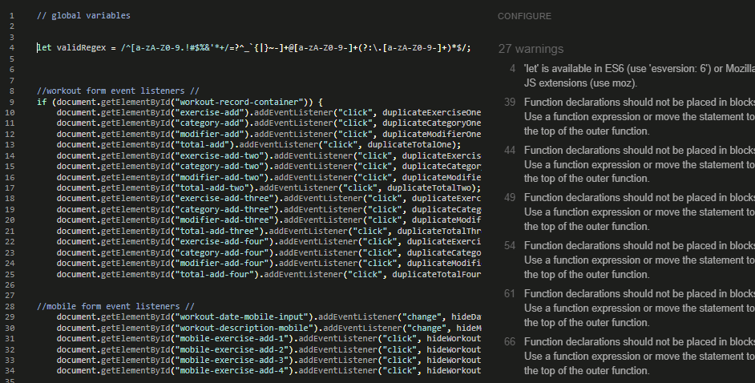

##### PEP8 Compliance Checking

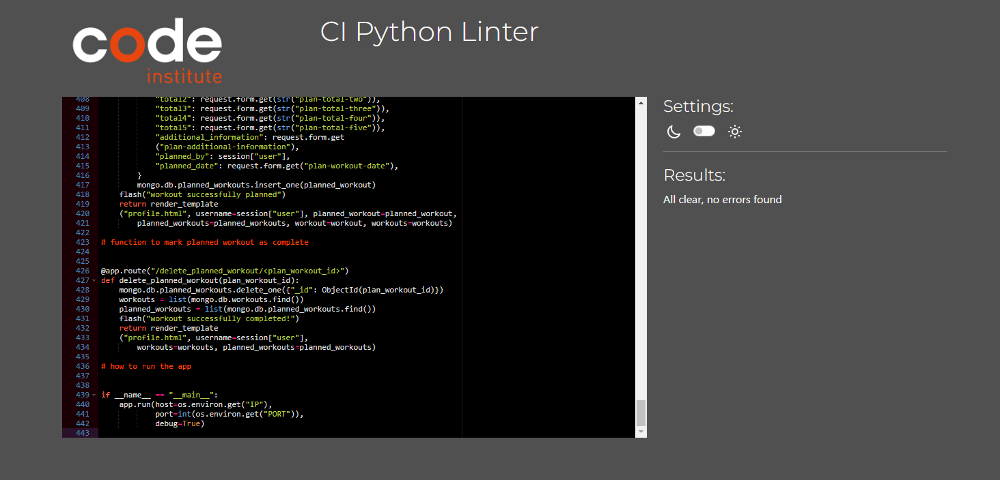

### Deployment

No further bugs found between development and final deployment as per videos. Developed as Flask app and deployed to Heroku via GitHub integration and the main branch.

Deployed as a live site to Heroku so new and existing users can discover the app and use its full functionality to keep track of their workouts and set themselves new fitness goals based on community metrics and statistics.

Heroku is required to run the Python and backend functionality such use depends on.

### Usage

The live deployed app is publicly available at https://gym-logger-4332586599d1.herokuapp.com/ for users to access freely and navigate accordingly. Free registration is necessary to browse the full site and access full functionality.

### Acknowledgments

I'd like to thank my Code Institute assigned mentor Daisy McGirr for her support and input.

### Further Development

- Carousels.
- More user metrics including personal bests, weekly workout frequency, live totals.
- Forgot password feature.
